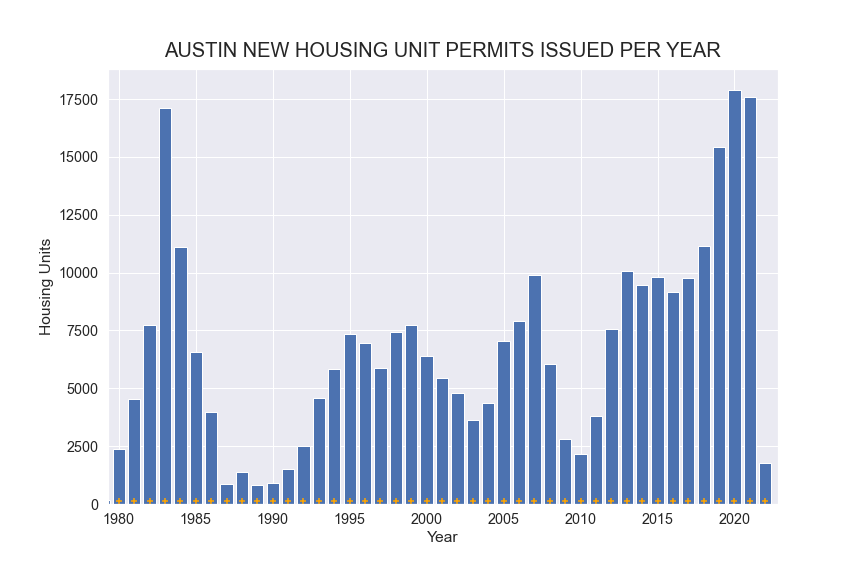
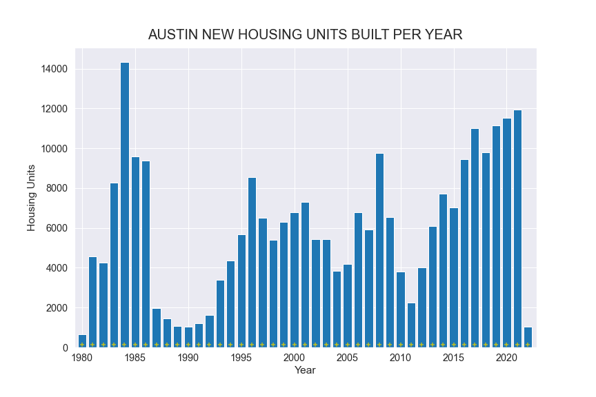
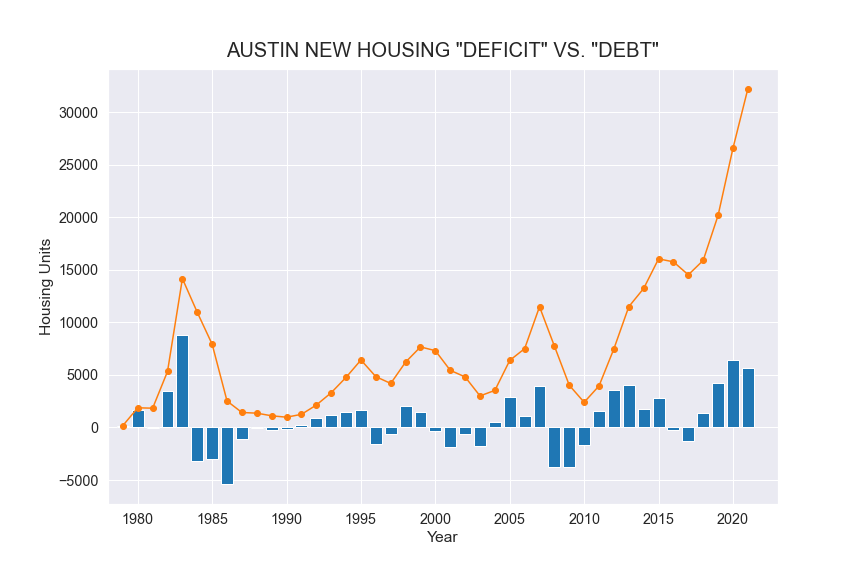
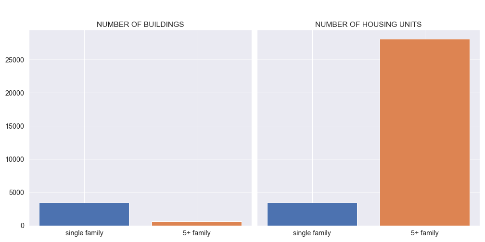
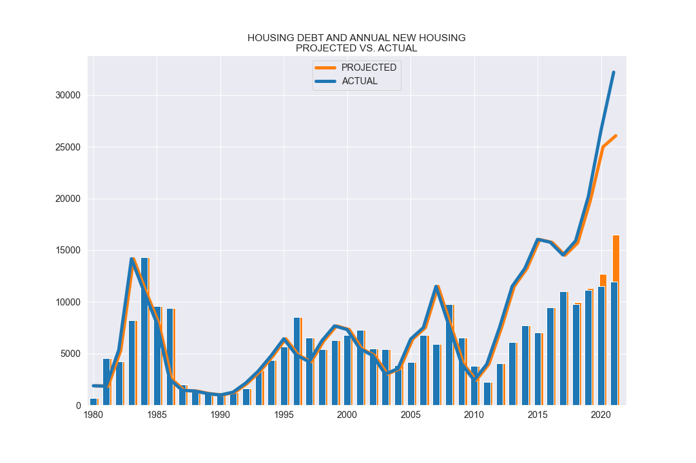

## UNDERSTANDING THE AUSTIN HOUSING MARKET BY LOOKING AT NEW HOUSING SUPPLY

There are a nearly infinite variety of factors that influence pricing in any housing market, but to simplify things for easier comprehension, it can be helpful to summarize those factors into the categories of supply and demand. If a giant, foreign investment company collapses and liquidates assets in the region, you can just think of it as a bump in supply. If the region is trending as the "Best Place to Move" by influencers and landed major tech company relocations, these are just examples of increases in demand. The most common way to measure the demand in an area is with changes in home pricing. When demand goes up, buyers compete with higher prices. But these forces dont play out in isolation, and as prices rise the incentive for builders and investors to create new housing rises. So another great metric to look at to understand the demand in a housing market is the amount of new construction happening. 

Austin has a great [data set](https://data.austintexas.gov/Building-and-Development/Issued-Construction-Permits/3syk-w9eu) containing all of the city's building permits since about 1980, and using this data we can create a chart that shows the demand for new construction over time. 

The above chart is a way of representing the demand for housing in Austin. Now it is easy to see that there was a lot of demand for housing in 1983, and very little demand for housing in 1990. But to have context to understand the relative value of the demand we need to illustrate the supply. Below, I use the same dataset but instead of housing units permitted, I use the number of housing units that are built and arrive to the market for each year.

Although these measures seem very similar, they can be quite different because of the time it takes to build housing units to fulfill the demand. These measures would be identical if housing could be built instantly, but some large, multi-unit buildings can take 3+ years to arrive to market and a lot can change in that time. Below are the supply and demand values plotted as lines. Notice how the peaks and valleys of the supply line are similar to the demand peaks and valleys, but offset by about a year or two. 

Also notice how the lines cross back and forth, years where the orange line is on top means that more housing units were demanded than were able to be produced, and years when the blue line is on top means that more housing units were built than new units were demanded. In this instance, we know that the demand is causal because a permit getting issued causes a unit to be built, and a unit can NOT be built unless a permit is issued first. If we frame this graph in terms of the difference between demand and supply we can see the number of "unbuilt" houses per year. Think of this yearly "unbuilt" as the annual housing supply "deficit" and this deficit can be positive or negative. In years where the orange line is on top there is a positive housing deficit that adds to the cumulative total of housing units that are permitted but not built, and years where the blue line is on top the deficit is negative and reduces the running total number of unbuilt housing units. While the deficit can be positive or negative on a given year, the running total or housing unit "debt" can only go as low as zero, since a negative number would mean that more housing units have been built than have been permitted overall. 

This graph is pretty hard to make sense of by itself, but what we can see is that what goes up seems to come back down. Why is this? Simply put: overbuilding. There is a positive feedback loop where when supply becomes low, demand will be relatively higher raising prices and incentivizing new construction until the supply becomes high enough to cause prices to drop and building to slow. But because some large buildings can take years to complete, the demand will often be satisfied before the market can send the signal to builders to stop building. The result is overbuilding, there is more housing supply than the market demands. Notice here how the level of building seems to correspond to the level of deficit that follows. 

But the market does not work well if it is too "tight", having a little bit of excess housing in the market allows for new people to enter the market and for people to have options when they decide to move. Below we take a look at the Austin housing market in terms of cumulative deficit, or housing supply "debt" for each year. 

What you probably notice about that chart is that the number of housing units currently being built right now is really, really high compared to historical norms.

### I. Why is this the case?
1) Most of the housing under construction are, large multi-family buildings, like apartment buildings or multi-story condominiums. While there are 5X more single family homes than 5+ family buildings currently being built, there are over 8X as many housing units produced by the 5+ family buildings. This means that nearly 90% of all the housing currently under construction is in these large, multifamily buildings.

2) Multifamily buildings take significantly longer to build than single family housing. 5+ family buildings have a median build time of 610 days, thats almost 3X as long as the median build time of single family homes!

3) Supply chain and Covid related delays have added additional time to getting these larger buildings to market. Using a machine learning model to forcast completion dates for the active permits, I generated a view of how we would expect to see housing supply to arrive to the market in more normal times. It is important to note here that this model is just an estimate, and that I am making the assumption that the differences in between the model and the actual values are solely attributable to delays and uncertaintly caused by Covid. In reality, it is much more complex than that, but these models and assumptions can be helpful tools to identify trends using counterfactual events that would otherwise be impossible to measure.

4) These large buildings taking extra time to get to market has broken the natural feedback loop that disincentivizes additional construction and prevents overbuilding which can contribute to long periods of home price stagnation or decline. As home prices rise, builders and investors are incentivized to build new housing so we see the number of housing units permitted go up. As the waves of new housing arrive to the market, the market balance begins to shift from favoring sellers to favoring buyers, disincentivizing builders from seeking additional permits. However, the housing already in progress will likely continue to arrive to the market beginning to drive prices down. Currently, Austin is experiencing unprecendented amounts of demand for new housing, but the large scale of some of these projects underway combined with building delays has resulted in broken feedback loop as skyrocketing prices continue to encourage even more building.

### II. Why does this matter?
In a perfect market, the lines for construction supply and demand would track parallel to eachother and in optimal proportion to the market demand. The real world market is more like a game of musical chairs where the person putting out the chairs does not know how many people will be playing. The game becomes very intense if more people play than were expected, but if too many chairs are put out then there is no competition necessary at all.

So how many people are playing the game and how many chairs are there?

Here we can see that these increases seem to tend back towards their averages over time. While the actual line of best fit slightly decreases over time, these mean lines provides nice, conservative baselines to project the actual housing demand in the near future to see if this feedback loop has lead to potential overbuilding. Using this 2% annual increase line as an estimate for "true" market demand effectively smooths out the housing demand as expressed by units permitted per year. Additionally, since this line is independant from the housing supply, we can use this line to compare theoretical demand to actual supply and see where there has been housing surplus from overbuilding and housing shortage from inadequate supply. This allows us to understand the context of the current building boom and see how the resulting wave of supply will effect the market.

